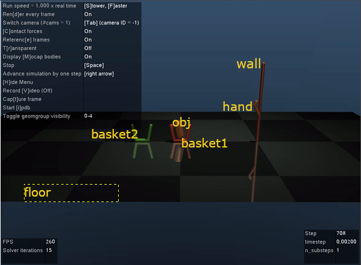

# Mujoco-Py-Tut


Mujoco is a powerful physics simultation, typically used to simulate robotics models in order to teach them how to solve tasks via [reinforcement learning](http://incompleteideas.net/book/RLbook2020.pdf). This is generally done through [OpenAI's Gym toolkit](https://gym.openai.com/). In fact, the gif above shows a trained model solving the [Tosser](https://github.com/openai/mujoco-py/blob/master/examples/tosser.py) environment. We're going to explore this environment and hopefully gain a good understanding of the interplay between Mujoco's model config XMLs and the python environment script.

## Mujoco Modeling (XMLs)

Right off the bat, the first place you should go for figuring things out is the [Mujoco documentation](http://www.mujoco.org/book/). This section will mainly correspond to the [modeling section](http://www.mujoco.org/book/modeling.html) and [XML reference](http://www.mujoco.org/book/XMLreference.html).


Let's start by looking at the XML for the Tosser model:

```xml
<!-- Author: vikash@openai.com-->
<mujoco model='tosser-v1.5'>
    <compiler inertiafromgeom='auto' angle='radian'/>

    <default>
        <joint limited='true' damping='1' armature='0'/>
        <geom contype='1' conaffinity='1' condim='3' rgba='0.8 0.6 .4 1'
        	margin="0.001" solref=".02 1" solimp=".8 .8 .01" material="geom"/>
        <motor ctrlrange='-1 1'  ctrllimited='true'/>
    </default>

    <option timestep='0.002' iterations="50" solver="PGS">
        <flag energy="enable"/>
    </option>

    <visual>
        <map fogstart="3" fogend="5" force="0.1" znear="0.1"/>
        <quality shadowsize="2048"/>
        <global offwidth="800" offheight="800"/>
    </visual>

    <asset>
		<texture type="skybox" builtin="gradient" width="128" height="128" rgb1=".4 .6 .8" 
            rgb2="0 0 0"/>  
        <texture name="texgeom" type="cube" builtin="flat" mark="cross" width="127" height="1278" 
            rgb1="0.8 0.6 0.4" rgb2="0.8 0.6 0.4" markrgb="1 1 1" random="0.01"/>  
        <texture name="texplane" type="2d" builtin="checker" rgb1=".2 .3 .4" rgb2=".1 0.15 0.2" 
            width="512" height="512"/>  

        <material name='MatPlane' reflectance='0.5' texture="texplane" texrepeat="1 1" texuniform="true"/>
        <material name='geom' texture="texgeom" texuniform="true"/>
    </asset>

	
	
    <worldbody>     
        <light directional='false' diffuse='.8 .8 .8' specular='0.3 0.3 0.3' pos='0 0 4.0' dir='0 -.15 -1'/>
		<geom name='floor' pos='0 -1 0' size='1.5 3 .125' type='plane' material="MatPlane" condim='3'/>
				
		<body name='wall' pos='0 0 0'>
			<geom name='wall' pos='0 0 .5' size='.02 .5' type='capsule' rgba='.73 .4 .4 1'/>		
			<body name='hand' pos='0 0 0'>
				<geom name='palm' type='capsule' size='.02' fromto='0 0 .7 0 -.1 .6'/>
				<geom name='finger' type='capsule' size='.02' fromto='0 -.1 .6 0 -.15 .6'/>
				<joint name='wr_js' type='slide' pos='0 0 .7' axis='0 0 1' range='-.6 .25' damping='10'/>
				<joint name='wr_jr' type='hinge' pos='0 0 .7' axis='1 0 0' range='-1.57 0.8'/>
			</body>
		</body>
			
		<body name='obj' pos='0 -.08 1'>
			<!--<geom name='obj' type='box' size='.05 .05 0.05'/>-->
			<!--<geom name='obj' type='sphere' size='.05'/>-->
			<geom name='obj' type='capsule' size='.05 .075'/>
			<joint name='ballz' type='slide' axis='0 0 1' limited='false' damping='.01'/>
			<joint name='bally' type='slide' axis='0 1 0' limited='false' damping='.01'/>
			<joint name='ballx' type='hinge' axis='1 0 0' limited='false' damping='.01'/>
		</body>
		
		<body name='basket1' pos='0 -1 0'>
			<geom pos='0 -.1 .12' type='capsule' size='.02 .1' rgba='1 .4 .4 1' condim='1' euler='.2 0 0'/>
			<geom pos='0  .1 .12' type='capsule' size='.02 .1' rgba='1 .4 .4 1' condim='1' euler='-.2 0 0'/>
			<geom pos='0  0 .02' type='capsule' size='.02 .08' rgba='1 .4 .4 1' condim='1' euler='1.57 0 0'/>
			<site name='t1' pos='0 0 .03' type='box' group='4' size='.02 .1 .02'/>
		</body>
		<body name='basket2' pos='0 -1.5 0'>
			<geom pos='0 -.1 .12' type='capsule' size='.02 .1' rgba='.4 1 .4 1' condim='1' euler='.2 0 0'/>
			<geom pos='0  .1 .12' type='capsule' size='.02 .1' rgba='.4 1 .4 1' condim='1' euler='-.2 0 0'/>
			<geom pos='0  0 .02' type='capsule' size='.02 .08' rgba='.4 1 .4 1' condim='1' euler='1.57 0 0'/>
			<site name='t2' pos='0 0 .03' type='box' group='4' size='.02 .1 .02'/>
		</body>
          
	</worldbody>

    <actuator>
		<motor name='a1' 	gear='35' joint='wr_js'/>
		<motor name='a2'    gear='35' joint='wr_jr' />
    </actuator>
	
	<sensor>
		<jointpos name="Sjp_wr_js"	joint="wr_js"/>
		<jointpos name="Sjp_wr_jr"	joint="wr_jr"/>
		<touch name="s_t1"	site="t1"/>
		<touch name="s_t2"	site="t2"/>
	</sensor>

</mujoco>
```

Again, the [modeling section](http://www.mujoco.org/book/modeling.html) and [XML reference](http://www.mujoco.org/book/XMLreference.html) sections explain everything going on here. I suggest giving [modeling section](http://www.mujoco.org/book/modeling.html) a quick read and then looking at the XML, then cross referencing any sections in the XML to the [XML reference](http://www.mujoco.org/book/XMLreference.html) and then going back to the [modeling section](http://www.mujoco.org/book/modeling.html) to drill down on anything you need to clarify. That's been my basic workflow when I'm ~~shamelessly copying~~ **implementing** a model. Also, to be honest I rarely implement my own model but this is a great exercise to get a good understanding of how things work in Mujoco. I've also personally found it to be a good refresher/intro to robotics as well.

XML's simply describe a hierarchical relation of objects. In this case, the top-level element

```xml
<mujoco model='tosser-v1.5'>
```

declares that this XML describes a **mujoco** object and, ultimately, a MJCF file (I'm pretty sure MJCF means Mujoco Config/Control File). The **model** attribute sets the file's name.

The first child element of the **mujoco** top-level element:

```xml
<compiler inertiafromgeom='auto' angle='radian'/>
```

set's some compiler options. The **inertiafromgeom** attribute controls the automatic inference of body masses and inertias from geoms attached to the body, and the **angle** attribute sets the unit for measuring angles, in this case it's set to radians.

Next, there is the Defaults block:

```xml
<default>
    <joint limited='true' damping='1' armature='0'/>
    <geom contype='1' conaffinity='1' condim='3' rgba='0.8 0.6 .4 1'
        margin="0.001" solref=".02 1" solimp=".8 .8 .01" material="geom"/>
    <motor ctrlrange='-1 1'  ctrllimited='true'/>
</default>
```

Defaults are basically class attributes. If you consider a **mujoco** model as a class, Defaults are used for child classes inheriting from the **mujoco** class, and each child class will inherit each attribute set in Defaults unless they're overridden. The [Defaults Settings section](http://www.mujoco.org/book/modeling.html#CDefault) of the documentation goes into greater detail but if you're familar with object oriented programming and inheritance, it's pretty clear.

The next block, Options:

```xml
<option timestep='0.002' iterations="50" solver="PGS">
    <flag energy="enable"/>
</option>
```

are simulation options. The **timestep** attribute sets the simulation time-step in seconds. You can tweak this attribute to speed up or slow down the simulation, or set it to be as realistic as possible with respect to any hardware you're modeling. **iterations** sets the maximum amount of steps for the constraint solver, in this case it is being set to **PGS**. **PGS** stands for the [Projected Gauss-Seidel](https://en.wikipedia.org/wiki/Gauss%E2%80%93Seidel_method) algorithm. Finally a **flag**, which enables or disables certain simulation features. In this case, it is enabling **energy** calculations to monitor energy in the system.

Next, the Visuals block:

```xm
<visual>
    <map fogstart="3" fogend="5" force="0.1" znear="0.1"/>
    <quality shadowsize="2048"/>
    <global offwidth="800" offheight="800"/>
</visual>
```

set certain attributes for generating how objects are rendered. The first four attributes - **fogstart**, **fogend**, **force**, **znear** - are **map**s. A **map** is used to specify scaling quantities that affect both the visualization and built-in mouse perturbations. In this case the start and ending poings for the linear fog generated by the visualizer. **force** controls the visualization of both contact forces and perturbation forces. **znear** determines the clipping planes of the OpenGL projection. The near clipping plane is particularly important: setting it too close causes (often severe) loss of resolution in the depth buffer, while setting it too far causes objects of interest to be clipped, making it impossible to zoom in. **shadowsize** is a **quality** attribute. **quality** settings affect the quality of the rendering. In this case, **shadowsize** specifies the size of the square texture used for shadow mapping. Higher values result is smoother shadows. Finally, we have two **global** **visual** attributes - **offwidth** and **offheight**. They specify the size in pixels of the off-screen OpenGL rendering buffer - width and height, respectively.

The next block, Assets:

```xml
<asset>
    <texture type="skybox" builtin="gradient" width="128" height="128" rgb1=".4 .6 .8" 
        rgb2="0 0 0"/>  
    <texture name="texgeom" type="cube" builtin="flat" mark="cross" width="127" height="1278" 
        rgb1="0.8 0.6 0.4" rgb2="0.8 0.6 0.4" markrgb="1 1 1" random="0.01"/>  
    <texture name="texplane" type="2d" builtin="checker" rgb1=".2 .3 .4" rgb2=".1 0.15 0.2" 
        width="512" height="512"/>  

    <material name='MatPlane' reflectance='0.5' texture="texplane" texrepeat="1 1" texuniform="true"/>
    <material name='geom' texture="texgeom" texuniform="true"/>
</asset>
```

simply sets things like **material**s and **texture**s that are shared between models. **material**s are used to control the appearance of geoms, sites and tendons. **texture**s an be loaded from PNG files or synthesized by the compiler based on user-defined procedural parameters and are projected onto shapes in the model.

The most important parts of the model XML are the **worldbody**, **actuator**, and **sensors** blocks. First, the **worldbody** block:

```xml
<worldbody>     
	<light directional='false' diffuse='.8 .8 .8' specular='0.3 0.3 0.3' pos='0 0 4.0' dir='0 -.15 -1'/>
	<geom name='floor' pos='0 -1 0' size='1.5 3 .125' type='plane' material="MatPlane" condim='3'/>
				
	<body name='wall' pos='0 0 0'>
		<geom name='wall' pos='0 0 .5' size='.02 .5' type='capsule' rgba='.73 .4 .4 1'/>		
		<body name='hand' pos='0 0 0'>
			<geom name='palm' type='capsule' size='.02' fromto='0 0 .7 0 -.1 .6'/>
			<geom name='finger' type='capsule' size='.02' fromto='0 -.1 .6 0 -.15 .6'/>
			<joint name='wr_js' type='slide' pos='0 0 .7' axis='0 0 1' range='-.6 .25' damping='10'/>
			<joint name='wr_jr' type='hinge' pos='0 0 .7' axis='1 0 0' range='-1.57 0.8'/>
		</body>
	</body>
			
	<body name='obj' pos='0 -.08 1'>
		<!--<geom name='obj' type='box' size='.05 .05 0.05'/>-->
		<!--<geom name='obj' type='sphere' size='.05'/>-->
		<geom name='obj' type='capsule' size='.05 .075'/>
		<joint name='ballz' type='slide' axis='0 0 1' limited='false' damping='.01'/>
		<joint name='bally' type='slide' axis='0 1 0' limited='false' damping='.01'/>
		<joint name='ballx' type='hinge' axis='1 0 0' limited='false' damping='.01'/>
	</body>
		
	<body name='basket1' pos='0 -1 0'>
		<geom pos='0 -.1 .12' type='capsule' size='.02 .1' rgba='1 .4 .4 1' condim='1' euler='.2 0 0'/>
		<geom pos='0  .1 .12' type='capsule' size='.02 .1' rgba='1 .4 .4 1' condim='1' euler='-.2 0 0'/>
		<geom pos='0  0 .02' type='capsule' size='.02 .08' rgba='1 .4 .4 1' condim='1' euler='1.57 0 0'/>
		<site name='t1' pos='0 0 .03' type='box' group='4' size='.02 .1 .02'/>
	</body>
	<body name='basket2' pos='0 -1.5 0'>
		<geom pos='0 -.1 .12' type='capsule' size='.02 .1' rgba='.4 1 .4 1' condim='1' euler='.2 0 0'/>
		<geom pos='0  .1 .12' type='capsule' size='.02 .1' rgba='.4 1 .4 1' condim='1' euler='-.2 0 0'/>
		<geom pos='0  0 .02' type='capsule' size='.02 .08' rgba='.4 1 .4 1' condim='1' euler='1.57 0 0'/>
		<site name='t2' pos='0 0 .03' type='box' group='4' size='.02 .1 .02'/>
	</body>       
</worldbody>
```

describes each of the constiuent "parts" of the model. 



There's a lot going on here. The [World Bodies section](http://www.mujoco.org/book/XMLreference.html#body) of the [XML reference](http://www.mujoco.org/book/XMLreference.html) describes each of the attributes in this section. I've labeled the screenshot above with each of the **body**(ies) in the scene. A **VERY IMPORTANT NOTE**

#### AN OBJECT REQUIRES A **JOINT** TO BE SPECIFIED ON IT IN ORDER FOR THE OBJECT TO MOVE

**acuator**s move the object. **sensors** measure certain aspects of the model.

Now, I know I said these are the most important parts of the model and I've barely explained the parts in them. It's my hope that, as you've read through this section you've been cross referencing my explainations to the [XML reference](http://www.mujoco.org/book/XMLreference.html) and have ~~busted me on my flagrant plagiarism~~ seen where I got much of the information. If not


